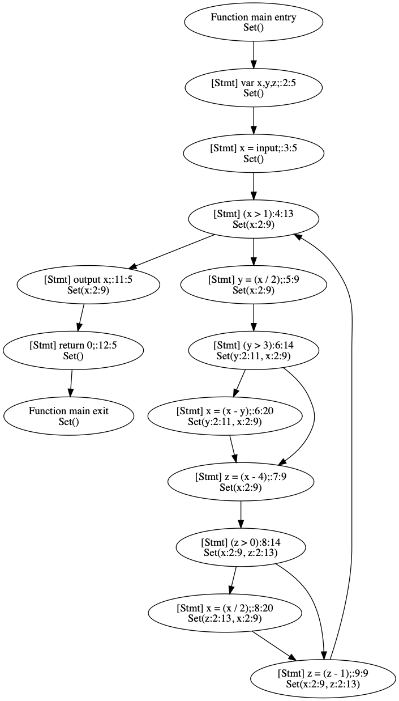
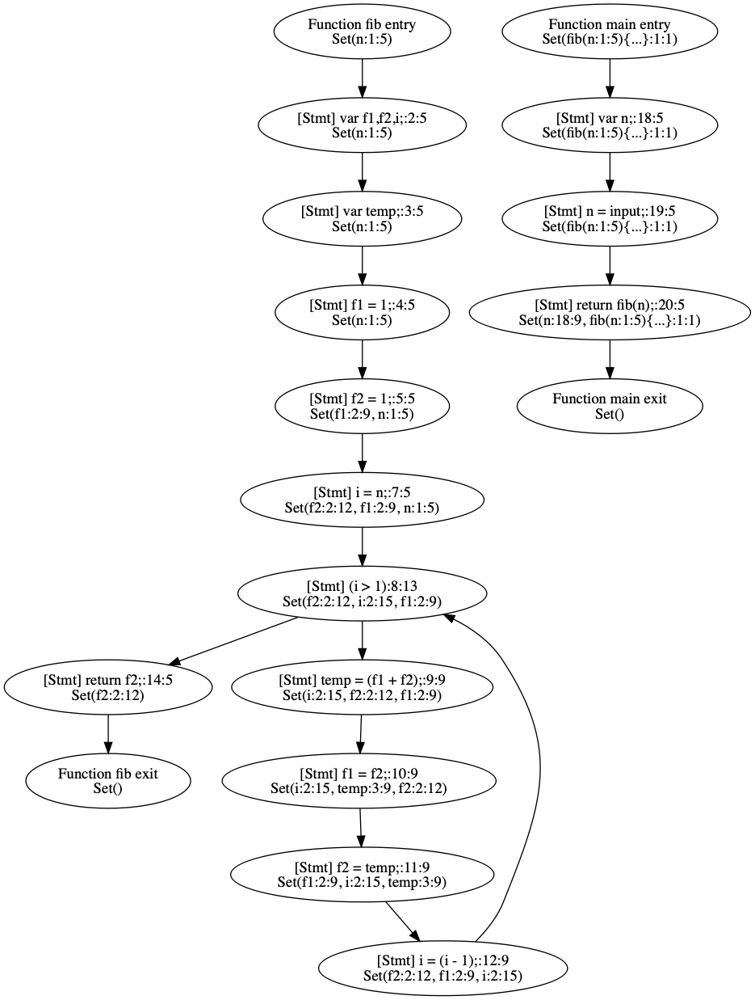
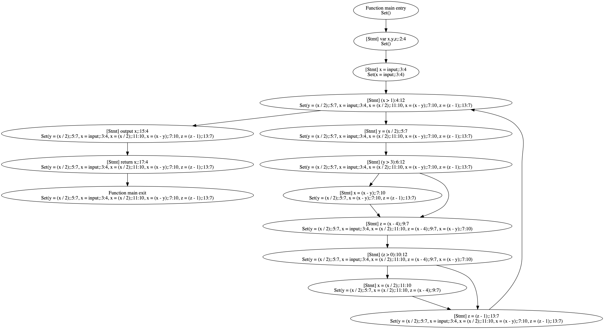
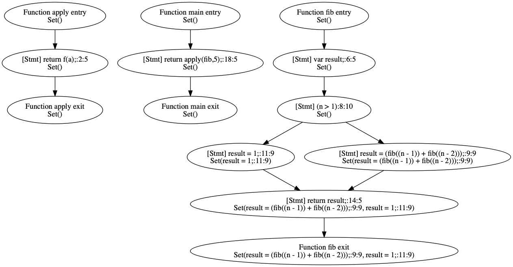

# Homework 2

## Part 1

The implementation is tested by analyzing several Tip's build-in examples and manually verifying the outputs. The primary test case we use is the example dedicated for liveness analysis *liveness.tip*, which is also the sample used in the SPA textbook (page 59). The output control flow graph is shown below, which aligns with the solution given in the book.



The above example has covered all the constraint rules implemented. Here we test one more example *fib.tip* which has multiple functions to verify function variables. It is also selected because it has no pointers. The graph is shown below and the result is reasonable.



## Part 2

Since the reaching definition is about the previous assignments which defined the current values, the set of effective assignments at the current node has to come from the predecessors. Therefore, our solvers adopt Tip's `ForwardDependencies` as a mixin. Because the assignments from the predecessors are unioned, we use Tip's powerset lattice `PowersetLattice` with the element type of the lattice as `AAssignStmt`.

Only assignment node has one constraint rule:
```
X=E: [v] = JOIN(v) \X U {X=E}
```

As our implementation snippet shows below, it filters out the assignments in the lattice who has the same identifier as the current node. Here uses `appearingIds` to find the declaration identifier to compare instead of identifier.

```scala
  case ass: AAssignStmt =>
    ass.left match {
      case id: AIdentifier =>
        s.filter { e =>
          !(e.left.appearingIds contains id)
        } + ass
```

Again, the implementation is tested through running Tip's build-in examples and manually verifying the outputs. The test example we use is *reaching.tip* and its corresponding control flow graph is shown below.



We also include another test case with multiple functions *apply2.tip*. Its graph is attached below and we believe the result is accurate.



## Part 3

We use reaching definition and the following code sample to describe the differences between simple fixpoint solver and worklist solver.

```
var x                     # x1
x = 1                     # x2
while (x > 0) {           # x3
  x = 0                   # x4
}
```

Simple fixpoint solver will do extra work recomputing in or out values when no change can happen because it computes all the nodes for every loop. For example, the simple fixpoint solver consumes 4 updates to get `x1: {}, x2: {x=1}, x3: {}, x4: {x=0}`. Since this is unfinished, it needs another 4 updates for all the nodes to get `x1: {}, x2: {x=1}, x3: {x=1, x=0}, x4: {x=0}`. Actually, in the last round, only `x3` needs updates. Other computations are wasted.


In comparison, the worklist solver keeps track of nodes that might need to be updated in the worklist until no node changes, and it will only add the dependents of those changed nodes into the queue of pending to update. Therefore, the worklist solver is more efficient compared with the simple fixpoint solver. For this example, the worklist solver has a queue initialized with all four nodes. After updating them in sequence for 4 steps, it has `x1: {}, x2: {x=1}, x3: {x=1}, x4: {x=0}`. One difference with the fixpoint is that `x3` has already joined the value from `x2`, because the worklist updates each node sequentially. More importantly, the worklist solver only needs two more updates to complete. Because when `x4` updates, it has added its dependents into the queue. As the reaching definition analysis solver uses `ForwardDependencies`, the dependent is the successor `x3` in this example. Therefore, the algorithm clearly knowns only `x3` need to update and since it indeed changes to `x3: {x=1, x-0}`, it further puts `x3`'s dependent `x4` into the queue. Since the updated `x4` keeps the same, the whole solving process ends.

